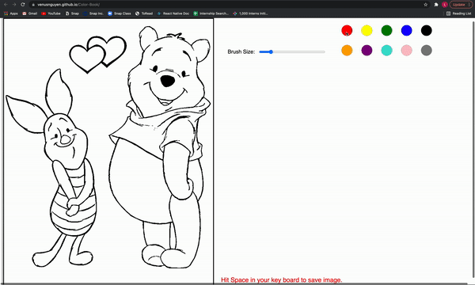

# Color Book

## Description

>A color book that will bring back your childhood and help grow your creativity.

## Link and Instruction

> **Instruction**
>* Choose the color you want by clicking on it
>* Use the slide to adjust the brush size
>* Hit space to save the image to your device
>* Try hit refresh to see the magic

>**Link**: https://venusnguyen.github.io/Color-Book/

## How to run

>1. Clone this repo to your personal device
>2. Open it in Visual Studio Code
>3. Install this extention: [Live Server](https://marketplace.visualstudio.com/items?itemName=ritwickdey.LiveServer)
>4. Click *Go Live* at the bottom right of your VSCode window or you can right click on the index.html and choose *Open with Live Server*

## Tools Used

* [p5.js](https://p5js.org/)
* [Template](https://github.com/Snap-Engineering-Academy-2021/p5-template)
